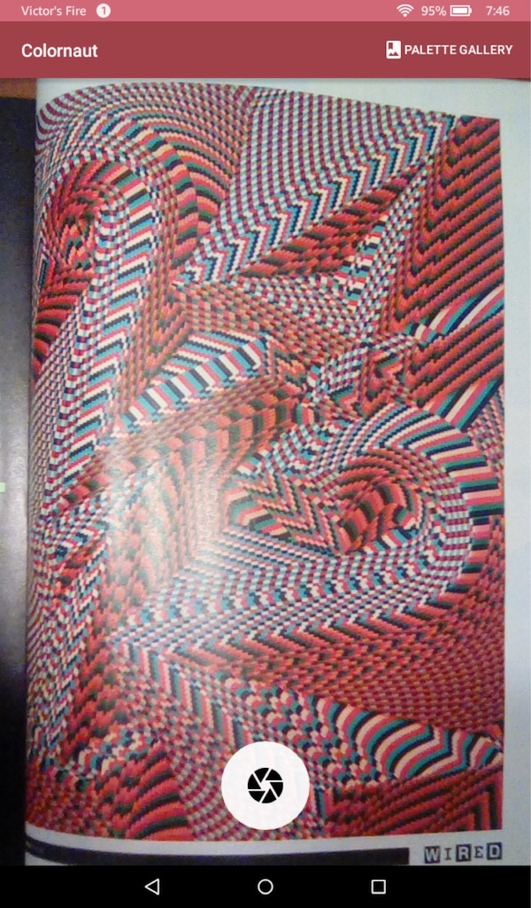
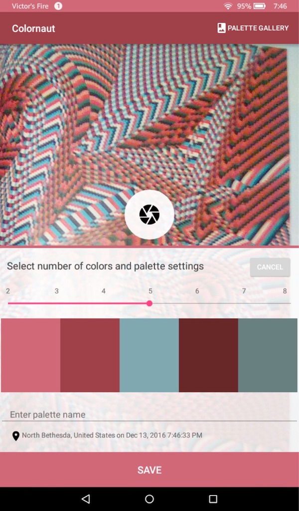
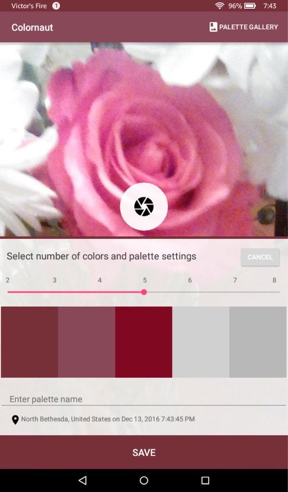
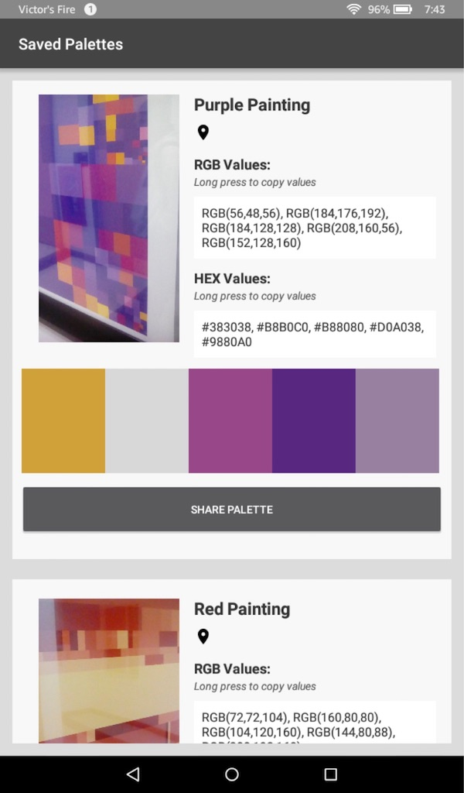
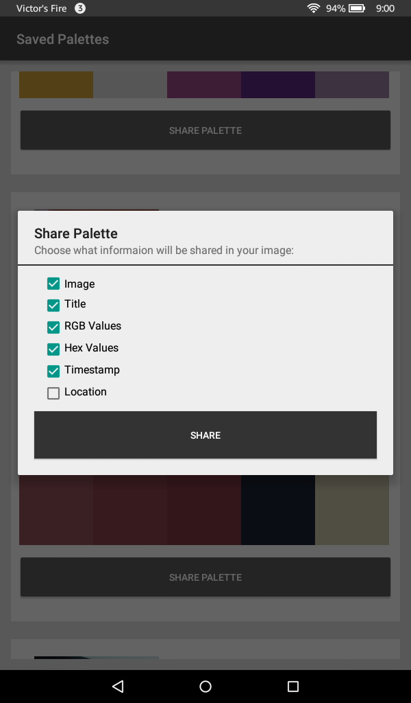

# Colornaut

Fall 2016 - CMSC 434

In order to run this program on the emulator make sure you change you use the API 22 and set the camera front and back to camera to Emulated in the AVD manager. (Camera may still not work on emulator, app runs better on an actual android device with a back camera.)

**Capture RGB and HEX color palettes from the world around you.**

- Use the camera to capture an image around you.
- Generate a color palette of 2-8 colors.
- Palettes include location and time of capture and optional name field. 
- View saved palettes in the Palette Gallery
- Long press on HEX or RGB values in the Palette Gallery to copy values to clipboard
- Share palette with selected features (photo, colors, values, location, name) to others on social media or to the device gallery (This feature has been mocked and was not able to be fully implemented yet).

**Screenshots**

*App launches into camera for quick capture.*

*Capture a photo and the palette is quickly created. The edit panel slides up to adjust settings.*

*Edit panel features a seeker to change palette size in real time, location and time data, and a title filed for naming the palette. Shutter button also remains available to retake the picture for a refined palette.*

*Palette Gallery shows all saved palettes. Long press on RGB or Hex values to instantly copy them to clipboard for bring the values into other applications quick and easily.*

*Share palettes with selected features to social media or to the device gallery.*